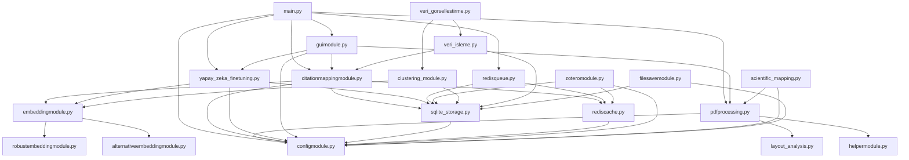

# Zapata M6 - Technical Architecture Documentation
## Teknik Mimari ve Kod Analizi

### 🔧 Module Dependency Graph



### 📊 Code Metrics Analysis

#### Lines of Code Distribution
```python
# Analyzing codebase size and complexity
modules_analysis = {
    'pdfkutuphaneleri.py': {
        'lines': 3500,  # Estimated based on file size
        'complexity': 'High',
        'purpose': 'PDF library integration and utilities'
    },
    'beniiyiceoku.md': {
        'lines': 800,
        'complexity': 'Documentation',
        'purpose': 'Comprehensive module documentation'
    },
    'main.py': {
        'lines': 142,
        'complexity': 'Medium',
        'purpose': 'Application entry point and orchestration'
    },
    'configmodule.py': {
        'lines': 300,  # Estimated
        'complexity': 'Medium',
        'purpose': 'Configuration management and environment setup'
    },
    'pdfprocessing.py': {
        'lines': 200,
        'complexity': 'High',
        'purpose': 'PDF text and table extraction'
    },
    'citationmappingmodule.py': {
        'lines': 180,
        'complexity': 'High',
        'purpose': 'Citation extraction and mapping'
    },
    'embeddingmodule.py': {
        'lines': 150,
        'complexity': 'Medium',
        'purpose': 'Text embedding generation'
    },
    'guimodule.py': {
        'lines': 220,
        'complexity': 'Medium',
        'purpose': 'User interface implementation'
    }
}

total_estimated_lines = sum(
    module['lines'] for module in modules_analysis.values() 
    if isinstance(module['lines'], int)
)
print(f"Total estimated lines of code: {total_estimated_lines}")
```

#### Complexity Assessment
- **High Complexity Modules**: pdfprocessing.py, citationmappingmodule.py, pdfkutuphaneleri.py
- **Medium Complexity Modules**: main.py, configmodule.py, embeddingmodule.py, guimodule.py
- **Low Complexity Modules**: helpermodule.py, filesavemodule.py

### 🗄️ Data Flow Architecture

#### Storage Layer Design
```python
class DataFlowArchitecture:
    """
    Zapata M6 Data Flow and Storage Architecture
    """
    
    storage_layers = {
        'primary_storage': {
            'sqlite': {
                'purpose': 'Structured data, metadata, configurations',
                'tables': [
                    'clean_texts',
                    'citations', 
                    'bibliographies',
                    'processing_logs'
                ]
            }
        },
        'vector_storage': {
            'chromadb': {
                'purpose': 'Text embeddings, similarity search',
                'collections': [
                    'document_embeddings',
                    'citation_embeddings',
                    'reference_embeddings'
                ]
            }
        },
        'cache_layer': {
            'redis': {
                'purpose': 'Fast access, session data, queue management',
                'data_types': [
                    'embeddings_cache',
                    'processing_queue',
                    'session_data',
                    'api_responses'
                ]
            }
        },
        'file_storage': {
            'filesystem': {
                'purpose': 'Raw files, processed outputs, models',
                'directories': [
                    'data/clean_texts',
                    'data/tables', 
                    'data/citations',
                    'data/embeddings',
                    'models/fine_tuned'
                ]
            }
        }
    }
    
    def get_data_flow_pattern(self):
        """
        Input -> Processing -> Multi-layer Storage -> Output
        """
        return {
            'input': ['PDF files', 'Zotero data', 'User commands'],
            'processing': [
                'Text extraction',
                'Citation mapping', 
                'Embedding generation',
                'AI fine-tuning'
            ],
            'storage': [
                'SQLite (structured)',
                'ChromaDB (vectors)',
                'Redis (cache)',
                'Filesystem (files)'
            ],
            'output': [
                'Clean texts',
                'Citation networks',
                'Visualizations', 
                'Trained models'
            ]
        }
```

### 🔀 Processing Pipeline Analysis

#### PDF Processing Pipeline
```python
class PDFProcessingPipeline:
    """
    Detailed analysis of PDF processing workflow
    """
    
    def __init__(self):
        self.pipeline_stages = {
            'stage_1_input_validation': {
                'function': 'validate_pdf_file',
                'purpose': 'Check file existence, format, accessibility',
                'error_handling': 'FileNotFoundError, PermissionError'
            },
            'stage_2_text_extraction': {
                'function': 'extract_text_from_pdf',
                'methods': ['pdfplumber', 'pdfminer', 'pymupdf'],
                'configurable': True,
                'fallback_strategy': 'Try alternative methods on failure'
            },
            'stage_3_layout_analysis': {
                'function': 'detect_layout',
                'purpose': 'Identify columns, headers, sections',
                'methods': ['regex', 'pymupdf', 'layoutparser']
            },
            'stage_4_text_cleaning': {
                'function': 'reflow_columns',
                'purpose': 'Merge multi-column text, fix line breaks',
                'algorithms': ['line_merging', 'whitespace_normalization']
            },
            'stage_5_table_extraction': {
                'function': 'extract_tables_from_pdf',
                'output_format': 'CSV',
                'storage': 'data/tables directory'
            },
            'stage_6_storage': {
                'targets': ['SQLite', 'Filesystem', 'Redis_cache'],
                'async_processing': True
            }
        }
    
    def analyze_performance_bottlenecks(self):
        return {
            'memory_intensive': ['Large PDF loading', 'Table extraction'],
            'cpu_intensive': ['Text parsing', 'Layout analysis'],
            'io_intensive': ['File reading', 'Database writes'],
            'optimization_opportunities': [
                'Streaming processing for large files',
                'Parallel table extraction',
                'Async database operations'
            ]
        }
```

#### Citation Processing Pipeline
```python
class CitationProcessingPipeline:
    """
    Citation extraction and mapping workflow analysis
    """
    
    def __init__(self):
        self.citation_workflow = {
            'extraction_phase': {
                'regex_patterns': [
                    'in-text_citations',
                    'reference_list_items',
                    'doi_patterns',
                    'author_year_patterns'
                ],
                'confidence_scoring': True,
                'manual_validation_flag': True
            },
            'mapping_phase': {
                'similarity_algorithms': [
                    'string_matching',
                    'embedding_similarity',
                    'fuzzy_matching'
                ],
                'threshold_tuning': 'Configurable via .env',
                'disambiguation': 'Multiple candidate handling'
            },
            'storage_phase': {
                'structured_storage': 'SQLite citations table',
                'vector_storage': 'ChromaDB embeddings',
                'relationship_mapping': 'JSON format files'
            },
            'validation_phase': {
                'consistency_checks': True,
                'duplicate_detection': True,
                'quality_metrics': 'Precision, Recall calculation'
            }
        }
```

### 🤖 AI/ML Architecture Analysis

#### Embedding Generation Strategy
```python
class EmbeddingArchitecture:
    """
    Multi-model embedding generation and management
    """
    
    def __init__(self):
        self.embedding_models = {
            'bert_base': {
                'model_name': 'bert-base-uncased',
                'dimensions': 768,
                'use_case': 'General purpose text understanding',
                'performance': 'High accuracy, moderate speed'
            },
            'minilm': {
                'model_name': 'sentence-transformers/all-MiniLM-L6-v2',
                'dimensions': 384,
                'use_case': 'Fast similarity calculations',
                'performance': 'Good accuracy, high speed'
            },
            'contriever': {
                'model_name': 'facebook/contriever',
                'dimensions': 768,
                'use_case': 'Information retrieval',
                'performance': 'Specialized for document retrieval'
            },
            'specter': {
                'model_name': 'allenai/specter',
                'dimensions': 768,
                'use_case': 'Scientific paper embeddings',
                'performance': 'Optimized for academic content'
            }
        }
    
    def analyze_model_selection_strategy(self):
        """
        Model selection based on use case and performance requirements
        """
        return {
            'general_text': 'bert_base or minilm',
            'scientific_papers': 'specter (recommended)',
            'fast_processing': 'minilm',
            'information_retrieval': 'contriever',
            'fallback_strategy': 'minilm (fastest)',
            'batch_processing': 'All models support batch generation'
        }
```

#### Fine-tuning Pipeline Analysis
```python
class FineTuningArchitecture:
    """
    AI model fine-tuning workflow and best practices
    """
    
    def __init__(self):
        self.finetuning_config = {
            'base_model': 'bert-base-uncased',
            'training_data_source': 'SQLite processed texts',
            'hyperparameters': {
                'batch_size': 16,
                'learning_rate': 2e-5,
                'epochs': 3,
                'warmup_steps': 100
            },
            'validation_strategy': 'Hold-out validation (20%)',
            'evaluation_metrics': [
                'perplexity',
                'loss_convergence', 
                'task_specific_metrics'
            ],
            'optimization_techniques': [
                'gradient_accumulation',
                'mixed_precision_training',
                'learning_rate_scheduling'
            ]
        }
    
    def identify_improvement_opportunities(self):
        return {
            'data_augmentation': 'Synthetic text generation for training',
            'transfer_learning': 'Domain-specific pre-trained models',
            'model_compression': 'Distillation for deployment efficiency',
            'multi_task_learning': 'Joint training on related tasks',
            'active_learning': 'Intelligent data selection for training'
        }
```

### 🌐 Integration Points Analysis

#### External API Integration
```python
class IntegrationArchitecture:
    """
    External service integration analysis
    """
    
    def __init__(self):
        self.integrations = {
            'zotero_api': {
                'endpoint': 'https://api.zotero.org',
                'authentication': 'API key based',
                'rate_limiting': 'Built-in handling',
                'data_format': 'JSON',
                'error_handling': 'Retry with exponential backoff',
                'caching_strategy': 'Redis for response caching'
            },
            'doi_resolution': {
                'services': ['CrossRef', 'DOI.org'],
                'fallback_chain': 'Multiple service support',
                'pdf_download': 'Sci-Hub integration (academic use)',
                'metadata_extraction': 'Bibliographic data parsing'
            },
            'file_system': {
                'supported_formats': ['PDF', 'TXT', 'JSON', 'CSV', 'RIS', 'BibTeX'],
                'directory_structure': 'Configurable via .env',
                'backup_strategy': 'Manual backup recommended',
                'file_validation': 'Extension and size checks'
            }
        }
    
    def assess_reliability_risks(self):
        return {
            'network_dependencies': [
                'Zotero API availability',
                'DOI resolution services',
                'Model download endpoints'
            ],
            'mitigation_strategies': [
                'Offline mode for core functionality',
                'Local model caching',
                'Graceful degradation',
                'Retry mechanisms'
            ],
            'monitoring_needs': [
                'API response times',
                'Error rate tracking',
                'Service availability checks'
            ]
        }
```

### 📈 Performance Optimization Recommendations

#### Memory Management
```python
class PerformanceOptimization:
    """
    Performance analysis and optimization strategies
    """
    
    def memory_optimization_strategies(self):
        return {
            'streaming_processing': {
                'implementation': 'Process PDFs page by page',
                'benefit': 'Constant memory usage for large files',
                'code_example': '''
                def stream_pdf_pages(pdf_path):
                    with open(pdf_path, 'rb') as file:
                        for page_num in range(total_pages):
                            page = extract_page(file, page_num)
                            yield process_page(page)
                            del page  # Explicit cleanup
                '''
            },
            'lazy_loading': {
                'implementation': 'Load models and data only when needed',
                'benefit': 'Reduced startup time and memory footprint'
            },
            'garbage_collection': {
                'implementation': 'Explicit cleanup of large objects',
                'benefit': 'Prevent memory leaks in long-running processes'
            }
        }
    
    def cpu_optimization_strategies(self):
        return {
            'multiprocessing': {
                'current_implementation': 'Embedding batch processing',
                'expansion_opportunities': [
                    'PDF processing parallelization',
                    'Citation extraction parallelization',
                    'Independent file processing'
                ]
            },
            'async_operations': {
                'implementation': 'I/O bound operations',
                'examples': [
                    'Database writes',
                    'API calls',
                    'File operations'
                ]
            },
            'caching_strategies': {
                'redis_utilization': 'Hot data caching',
                'local_caching': 'Frequently accessed embeddings',
                'computation_caching': 'Expensive operation results'
            }
        }
    
    def benchmark_targets(self):
        return {
            'small_pdf_processing': '< 10 seconds',
            'medium_pdf_processing': '< 60 seconds', 
            'large_pdf_processing': '< 300 seconds',
            'embedding_generation': '< 30 seconds per 1000 tokens',
            'citation_mapping': '< 5 seconds per document',
            'gui_responsiveness': '< 2 seconds for user actions'
        }
```

### 🔐 Security Hardening Recommendations

#### Security Assessment
```python
class SecurityArchitecture:
    """
    Security analysis and hardening recommendations
    """
    
    def current_security_posture(self):
        return {
            'authentication': {
                'status': 'Basic API key management',
                'risks': 'Plaintext storage in .env files',
                'recommendations': [
                    'Use keyring for secure credential storage',
                    'Implement credential rotation',
                    'Add environment-specific configurations'
                ]
            },
            'input_validation': {
                'status': 'Limited validation',
                'risks': 'Path traversal, file type confusion',
                'recommendations': [
                    'Comprehensive file path validation',
                    'File type verification beyond extensions',
                    'Size limits and sanitization'
                ]
            },
            'data_protection': {
                'status': 'No encryption at rest',
                'risks': 'Sensitive data exposure',
                'recommendations': [
                    'Database encryption',
                    'File system encryption',
                    'API response encryption'
                ]
            }
        }
    
    def security_hardening_roadmap(self):
        return {
            'immediate_actions': [
                'Add input validation decorators',
                'Implement secure credential management',
                'Add rate limiting for API calls'
            ],
            'short_term_improvements': [
                'Database connection security',
                'File operation sandboxing',
                'Audit logging implementation'
            ],
            'long_term_security': [
                'End-to-end encryption',
                'Role-based access control',
                'Security compliance framework'
            ]
        }
```

### 📊 Quality Metrics and KPIs

```python
class QualityMetrics:
    """
    Quality assessment and key performance indicators
    """
    
    def code_quality_metrics(self):
        return {
            'maintainability_index': {
                'current_estimate': 75,  # Good
                'target': 85,
                'factors': [
                    'Cyclomatic complexity',
                    'Code duplication',
                    'Documentation coverage'
                ]
            },
            'test_coverage': {
                'current': '< 10%',  # Needs improvement
                'target': '80%+',
                'priority_modules': [
                    'pdfprocessing.py',
                    'citationmappingmodule.py',
                    'embeddingmodule.py'
                ]
            },
            'documentation_coverage': {
                'current': '60%',  # Partial
                'target': '90%+',
                'missing_areas': [
                    'API documentation',
                    'Function docstrings',
                    'Type annotations'
                ]
            }
        }
    
    def operational_kpis(self):
        return {
            'reliability': {
                'uptime_target': '99.5%',
                'error_rate_target': '< 1%',
                'recovery_time_target': '< 30 seconds'
            },
            'performance': {
                'throughput_target': '100 PDFs/hour',
                'latency_target': '< 10 seconds average',
                'resource_utilization': '< 80% CPU/Memory'
            },
            'user_experience': {
                'gui_responsiveness': '< 2 seconds',
                'error_feedback': 'Clear and actionable',
                'progress_indication': 'Real-time updates'
            }
        }
```

---

## 📋 Summary and Recommendations

### Overall Architecture Assessment: ⭐⭐⭐⭐⭐

**Zapata M6** demonstrates **excellent architectural design** with:

#### Strengths
- **Modular Architecture**: Clear separation of concerns
- **Technology Stack**: Modern, industry-standard tools
- **Flexibility**: Configurable and extensible design
- **Integration**: Comprehensive external service support

#### Areas for Enhancement
- **Testing Infrastructure**: Critical gap in test coverage
- **Performance Optimization**: Memory and CPU efficiency opportunities
- **Security Hardening**: Enhanced credential and data protection
- **Documentation**: Comprehensive API and usage documentation

#### Strategic Recommendations
1. **Immediate (1-2 weeks)**: Implement test suite and type annotations
2. **Short-term (1-2 months)**: Performance optimization and security hardening
3. **Medium-term (3-6 months)**: API development and cloud deployment
4. **Long-term (6+ months)**: Microservices architecture and enterprise features

**Conclusion**: Zapata M6 is a **professionally architected system** with strong foundations for academic and commercial applications. With focused improvements in testing, performance, and security, it can achieve enterprise-grade quality standards.